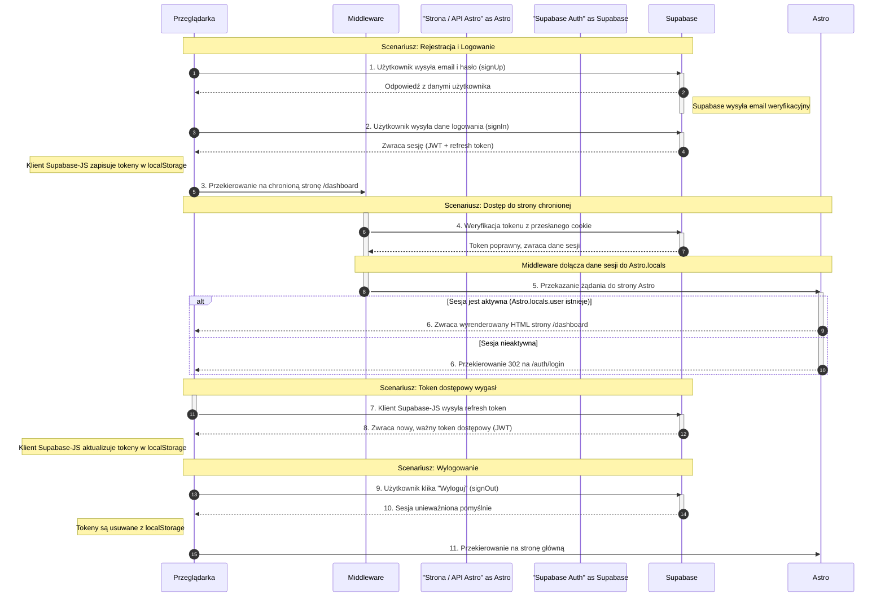

<mermaid_diagram>

```mermaid
sequenceDiagram
    autonumber
    participant Przeglądarka
    participant Middleware
    participant "Strona / API Astro" as Astro
    participant "Supabase Auth" as Supabase

    %% === Przepływ 1: Rejestracja i Logowanie Użytkownika ===
    Note over Przeglądarka, Supabase: Scenariusz: Rejestracja i Logowanie

    Przeglądarka->>Supabase: 1. Użytkownik wysyła email i hasło (signUp)
    activate Supabase
    Supabase-->>Przeglądarka: Odpowiedź z danymi użytkownika
    Note right of Supabase: Supabase wysyła email weryfikacyjny
    deactivate Supabase

    Przeglądarka->>Supabase: 2. Użytkownik wysyła dane logowania (signIn)
    activate Supabase
    Supabase-->>Przeglądarka: Zwraca sesję (JWT + refresh token)
    deactivate Supabase
    Note left of Przeglądarka: Klient Supabase-JS zapisuje tokeny w localStorage
    Przeglądarka->>Middleware: 3. Przekierowanie na chronioną stronę /dashboard

    %% === Przepływ 2: Dostęp do Chronionej Strony (SSR Guard) ===
    Note over Przeglądarka, Astro: Scenariusz: Dostęp do strony chronionej
    
    activate Middleware
    Middleware->>Supabase: 4. Weryfikacja tokenu z przesłanego cookie
    activate Supabase
    Supabase-->>Middleware: Token poprawny, zwraca dane sesji
    deactivate Supabase
    Note over Middleware,Astro: Middleware dołącza dane sesji do Astro.locals
    Middleware->>Astro: 5. Przekazanie żądania do strony Astro
    deactivate Middleware
    
    activate Astro
    alt Sesja jest aktywna (Astro.locals.user istnieje)
        Astro-->>Przeglądarka: 6. Zwraca wyrenderowany HTML strony /dashboard
    else Sesja nieaktywna
        Astro-->>Przeglądarka: 6. Przekierowanie 302 na /auth/login
    end
    deactivate Astro

    %% === Przepływ 3: Automatyczne Odświeżanie Tokenu (w tle) ===
    Note over Przeglądarka, Supabase: Scenariusz: Token dostępowy wygasł
    
    activate Przeglądarka
    Przeglądarka->>Supabase: 7. Klient Supabase-JS wysyła refresh token
    deactivate Przeglądarka
    activate Supabase
    Supabase-->>Przeglądarka: 8. Zwraca nowy, ważny token dostępowy (JWT)
    deactivate Supabase
    Note left of Przeglądarka: Klient Supabase-JS aktualizuje tokeny w localStorage

    %% === Przepływ 4: Wylogowanie ===
    Note over Przeglądarka, Supabase: Scenariusz: Wylogowanie
    
    Przeglądarka->>Supabase: 9. Użytkownik klika "Wyloguj" (signOut)
    activate Supabase
    Supabase-->>Przeglądarka: 10. Sesja unieważniona pomyślnie
    deactivate Supabase
    Note left of Przeglądarka: Tokeny są usuwane z localStorage
    Przeglądarka->>Astro: 11. Przekierowanie na stronę główną
```
</mermaid_diagram>

